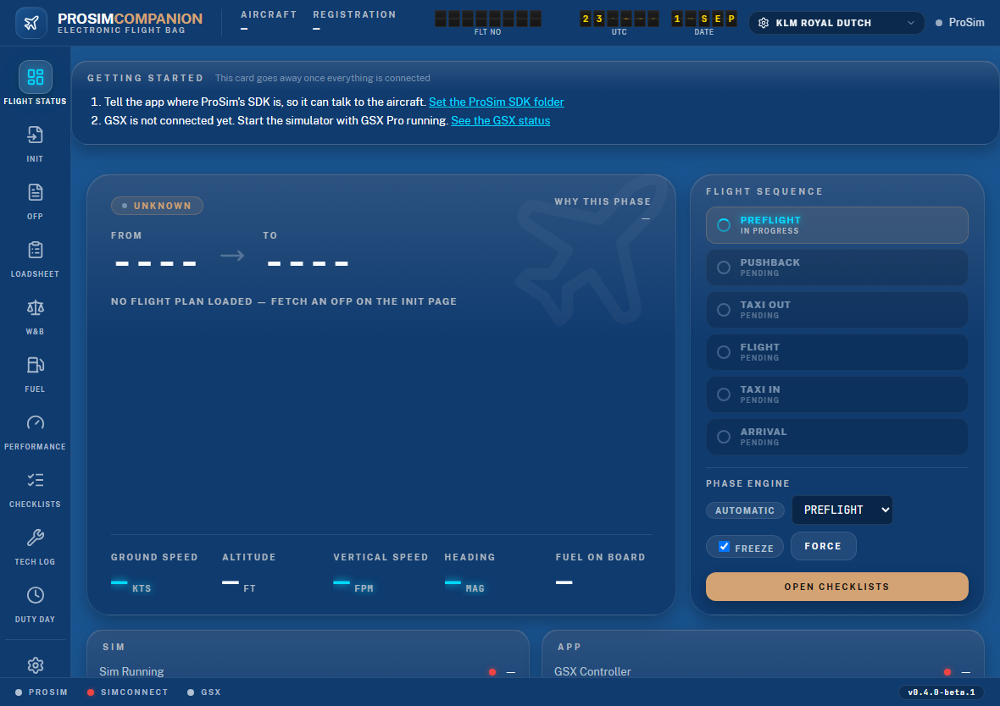
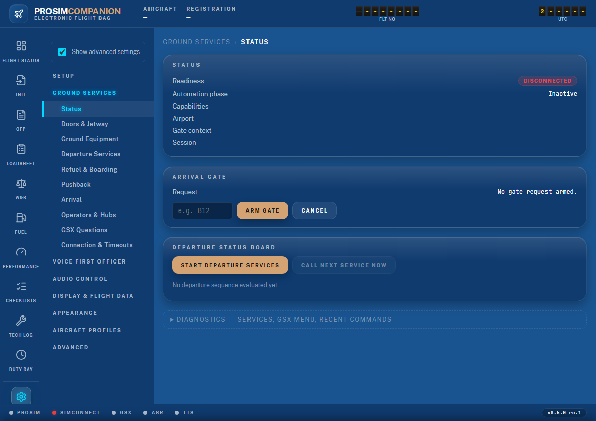
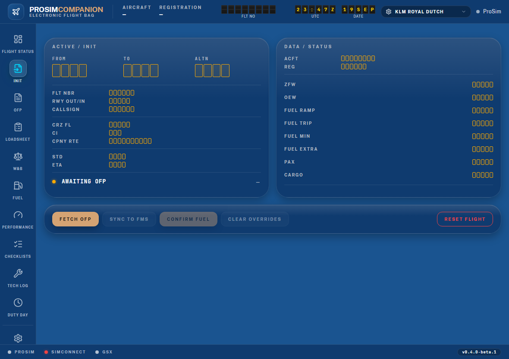
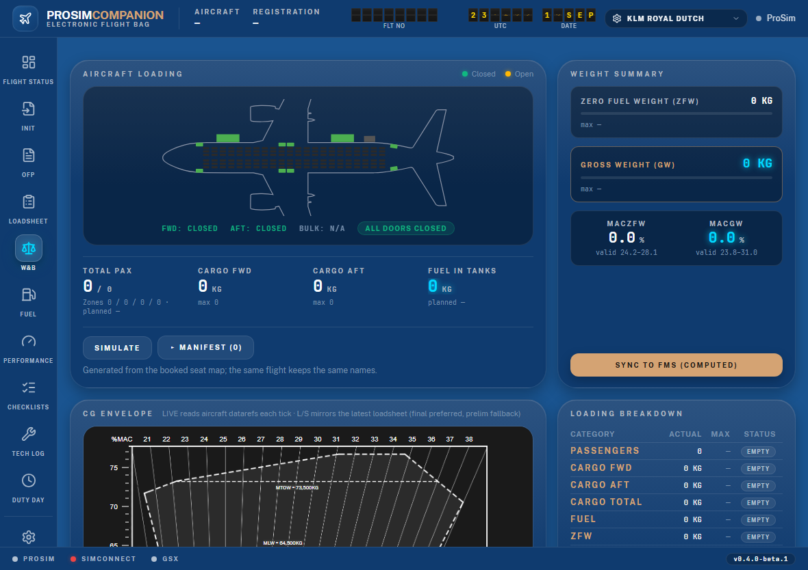
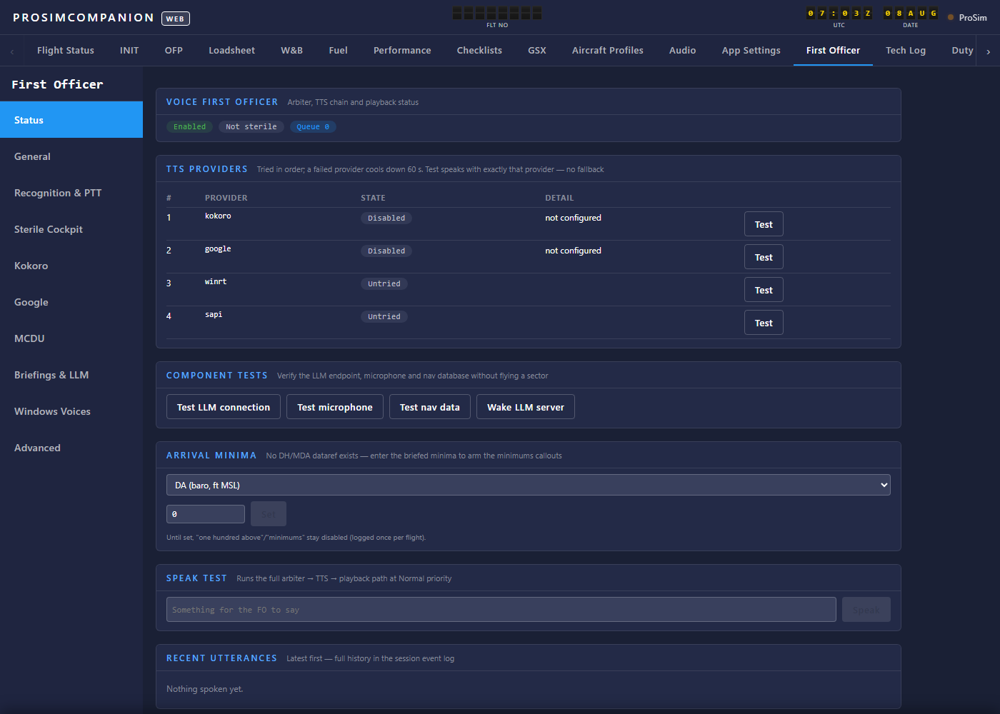
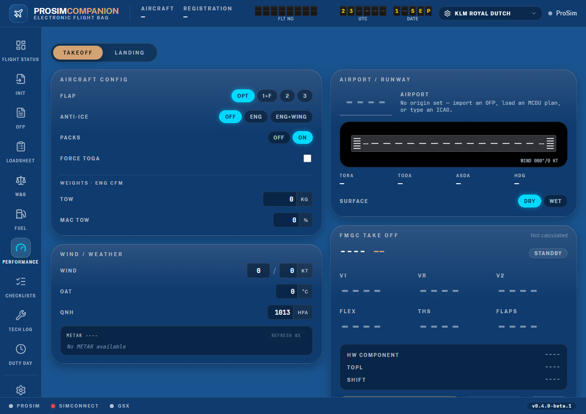

# ProsimCompanion

One companion app for the **ProSim A320 (A322)** in MSFS 2020/2024 — consolidating
**Prosim2GSX** (GSX ground-services automation), **ProsimInterface** (ProSim connectivity,
W&B, loadsheets) and **Prosim2FO** (voice First Officer) into a single, modern application.

A small desktop window starts the app; everything else — configuration, EFB, status — runs in
your **browser** (default `http://localhost:5320`), on the sim PC or from any phone/tablet on
your network via QR onboarding. The web UI is an electronic flight bag: an icon sidebar of
flight pages, live figures on glass instrument cards, and a Solari split-flap clock.



## Capabilities

### GSX ground automation
- Full departure-service sequencing with per-service activation rules, leg constraints
  (first-leg / turnaround / company-hub) and minimum flight time — driven through GSX Pro's
  Couatl Remote API with LVAR timing where it matters
- Refuel sync (fixed or dynamic rate, tankering skip, finish-on-hose), seat-map progressive
  boarding/deboarding that keeps ProSim's CG realistic at every stage
- Per-door-class automation (pax doors follow stairs, service doors follow catering, cargo
  doors follow the loaders), jetway/stairs lifecycle, ground equipment with PCA tri-state,
  chock delays and GPU/APU logic
- Beacon-orchestrated pushback (APU → doors → jetway → equipment → push, crew-realistic
  delays), GSX question auto-answering (direction, tug, crew, de-ice, operators), arrival
  gate assignment, stable-parked arrival handling with FOB save/restore
- An in-sim handler script bridges GSX events back to the app and renders your flight number
  and route on the **gate's VDGS display**
- Every action — and every deliberate non-action — lands in a decision log with its reason



### Flight data & EFB
- SimBrief OFP import (MCDU-triggered or manual) feeding an MCDU-style INIT page with
  per-field overrides and FMS INIT B sync
- In-house loadsheet pipeline (bit-exact ProSim formulas): prelim on refuel, final after
  boarding, ACARS uplink, per-weight **MAC envelope limits** digitized from the CG chart
- Live W&B with CG envelope, cabin/cargo/fuel state and an aircraft silhouette; takeoff &
  landing performance with FMS PERF uplink; ECAM-style interactive checklists
- Flight Status hero with **local / destination weather cards** (sky graphic, wind, visibility,
  ceiling, temperature, QNH, ATIS) and a **gate monitor** (Gate Closed → Gate Open → Boarding →
  Final Call → Gate Closed, from GSX boarding, door 1L and the STD)
- **Pop-out Flight Monitor** — one click opens a second-monitor board that is the gate monitor
  at the stand, the flight monitor from pushback to landing and the arrival monitor after
  block-in; scales as one piece to any window and shows your own logo for the OFP's airline




### Voice First Officer
- Spoken checklists beside the visual runner — challenge/response with verification against
  the aircraft, a monitored flight-control check, and never-give-up retry semantics
- SOP callouts (V1, rotate, positive climb, minimums…), stabilized-approach gates,
  flow-monitor and weather advisories, sterile cockpit
- Voice FCU/radio control behind a PF/PM handover, MCDU voice actions, ECAM abnormals with
  memory drills, departure/arrival briefings from Navigraph DFD + live weather
- Cabin crew and company/ACARS immersion, tech log & MEL with voice dialogues, pilot
  logbook, spoken post-flight debrief, multi-leg company day mode
- TTS chain (Kokoro local neural → Google Chirp HD → Windows voices) with caching and an
  intercom filter; LAN faster-whisper or offline recognition; PTT on keyboard or joystick
- An optional **persona** (name, experience, formality, chattiness) colours the FO's
  wording — numbers verified and locked, deterministic texts always the floor



### Audio control
- ProSim ACP knobs/latches drive Windows per-app session volumes (vPilot, BeyondATC, GSX,
  the sim…) or VoiceMeeter strips/buses, with per-ACP power gating and live backend switch

### Integrations & platform
- SayIntentions (spoken ATC requests, gate push, weather/CPDLC), ActiveSky weather chain,
  Elgato Stream Deck plugin, opt-in HTTP command/status API
- EFB-style web UI (ADR-0011): icon sidebar, glass instrument cards, split-flap clock,
  bundled fonts and icons (works offline), 13 airline/basic themes on the Appearance settings page
  plus user JSON themes and your own theme and airline logos (never shipped — you upload them), kg/lb
  display units, system tray, single-instance, update banner from
  GitHub releases
- Migrating from Prosim2GSX / Prosim2FO? Your existing configuration is **imported
  automatically on first run**



## Getting started

Grab the installer from [Releases](https://github.com/psyraxaus/ProsimCompanion/releases) —
it prompts for your ProSim SDK, VoiceMeeter and GSX (Virtuali) locations and installs the
ProSim A322 GSX profiles. See the **[User Manual](docs/manual/README.md)** for setup,
workflow and troubleshooting.

Requirements: Windows x64, .NET 10 Desktop Runtime, ProSim A322. MSFS/GSX/VoiceMeeter and
all network services are optional — anything absent simply disables its feature with
guidance.

## Building from source

```
dotnet build ProsimCompanion.slnx
dotnet test  ProsimCompanion.slnx
dotnet run --project src/ProsimCompanion.App
```

Requires the .NET 10 SDK on Windows. `ProSimSDK.dll` is compiled against locally (set the
`ProSimSdkDir` MSBuild property) and loaded at runtime from your ProSim installation — it is
**never bundled or redistributed**, and the installer build fails if it ever appears in the
payload. Release process: [docs/VERSIONING.md](docs/VERSIONING.md); installer:
[installer/README.md](installer/README.md).

## Documentation

- [User manual](docs/manual/README.md)
- [Architecture](docs/ARCHITECTURE.md) · [decision records](docs/decisions/)
- [Roadmap](docs/ROADMAP.md) · [feature inventory](docs/feature-inventory.md)
- [Integration references](docs/integrations/) — ProSim, GSX Remote API, SimBrief,
  SayIntentions, audio, speech/AI, Stream Deck, command API
