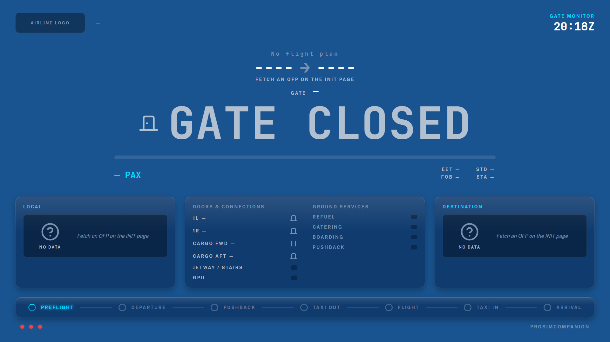

# Using the app

## Desktop shell & tray

The desktop window shows subsystem connection states and the web-server card (port, LAN
binding, access token, QR). Minimizing hides the window to the **system tray**; double-click
the tray icon (or *Show Window*) to bring it back, *Open Web UI* to jump to the browser,
*Exit* to quit. Closing the window exits the app. Starting the app twice just brings the
running instance's window to the front.

## Web UI tour

The web UI is laid out like an electronic flight bag. The **header** carries the aircraft type
and registration (from the OFP), the flight number and the SIM/UTC clock on split-flap
displays, a theme picker and the ProSim connection dot. The **sidebar** on the left lists the
flight pages in flight order with Settings pinned at the bottom; on a phone it becomes a
scrolling icon strip. The **footer** shows the ProSim, SimConnect and GSX connections and the
running version.

| Page | What it does |
|---|---|
| **Flight Status** | Route hero with two weather cards (local weather / weather at destination: sky graphic, wind, visibility, ceiling, temperature, QNH, ATIS letter, METAR time), the gate monitor strip (Gate Closed → Gate Open → Boarding → Final Call → Gate Closed, with the passenger count and the STD countdown) and its **Pop out** button, the live ground speed / altitude / vertical speed / heading / fuel figures, the flight sequence with the phase-engine controls, then the Sim/App/GSX/Services cards with state pills. Final-call thresholds and the weather refresh cadence live under Settings → Display & Flight Data → Flight Status card |
| **Flight Monitor** (pop-out) | A second-monitor board opened from the gate strip's Pop out button (or at `/monitor`) — see below |
| **INIT** | MCDU-style OFP display: fetch the SimBrief OFP, per-field overrides (ZFW, fuel, pax, cargo), SYNC TO FMS, confirm fuel, flight reset |
| **OFP** | Flight-plan hero, arrival-gate assignment, weather (METAR/TAF/ATIS), pushback-direction Korry buttons, de-ice holdover card |
| **Loadsheet** | Prelim/final loadsheets with per-weight MAC envelope brackets, manual STD, resend/reset |
| **W&B** | Aircraft silhouette with doors and pax/cargo totals, weight summary bars, the CG envelope chart with valid MAC ranges, loading breakdown, passenger manifest, SIMULATE |
| **Fuel** | Fuel summary with capacity bar and delta, tank breakdown |
| **Performance** | Takeoff and Landing switch — airport/runway card with runway chips, runway diagram and wind components, weather, aircraft config, FMGC figures, FMS PERF uplink |
| **Checklists** | ECAM-style interactive checklists with a completion bar and the checklist sequence rail (visual runner; the voice FO runs beside it) |
| **Tech Log / Duty Day** | MEL & tech log, multi-leg company day mode with a legs timeline |
| **⚙ Settings** | Everything you configure, on one rail (below) |

### The Flight Monitor window

**Pop out** on the Flight Status gate strip opens the Flight Monitor in its own browser window
(drag it to a second monitor, or open `/monitor` on the iPad). It is one fixed 1920×1080
picture that scales as a whole to the window, so nothing ever overlaps whatever the size or
shape. It changes face with the flight:

| Mode | When | What it shows |
|---|---|---|
| **Gate monitor** | at the stand | your airline logo (Settings → Appearance → Airline logos, matched to the OFP's airline code), flight number, route with airport names, the gate, the big state word (GATE CLOSED / GATE OPEN / BOARDING / FINAL CALL / GATE CLOSED), the passenger bar, EET / fuel / STD countdown / ETA, doors, jetway and GPU, the ground-services lamps, the local and destination weather cards, the flight sequence strip |
| **Flight monitor** | pushback → landing | the phase as the big word (PUSHBACK AND START, CLIMB, CRUISE…), the cruise level, a time-based progress bar (elapsed block time against the OFP's enroute time), off-blocks time and ETA, ground speed / altitude / vertical speed / heading, gear / flaps / seat-belt signs / beacon; the local weather card follows the aircraft (destination from descent, the alternate on the second card) |
| **Arrival monitor** | taxi-in → shutdown | TAXI IN / ON BLOCKS / DEBOARDING / ARRIVED, the arrival gate, the deboarding bar, block-in time, block and flight times, doors, GPU and the arrival services |

The header clock is sim time. The footer dots are the real ProSim / SimConnect / GSX connections.

### The Settings hub

The Settings entry (bottom of the sidebar) opens a rail grouped by pillar. Every section has
its own address, so a refresh or a link from a warning banner lands on the right cards.

| Rail entry | What it holds |
|---|---|
| **Setup** | The three master switches (GSX ground services, voice First Officer, audio control), the ProSim host/SDK path, nav data, web port/LAN access, the Stream Deck command API |
| **Ground Services** | Status board (departure services with hold/skip reasons, decision log, gate control) and all GSX behaviour: doors & jetway, ground equipment, departure services, refuel & boarding, pushback, arrival, operators & hubs, GSX questions, connection & timeouts |
| **Voice First Officer** | Status (provider tests, minima card, speak test), general, listening & PTT, sterile cockpit, crew voices, ground crew, cabin crew, briefings & LLM, MCDU, SayIntentions, voice providers |
| **Audio Control** | Status, backend choice, CoreAudio mappings, VoiceMeeter mappings, housekeeping |
| **Display & Flight Data** | Units, split-flap animation, loadsheet automation, the Flight Status card (final-call thresholds, weather refresh), checklist ticks |
| **Appearance** | Theme swatches, your theme logos for the header, your airline logos for the Flight Monitor |
| **Aircraft Profiles** | Per-aircraft settings profiles with automatic matching |
| **Advanced** | Flight phase engine thresholds, the live log viewer with capture settings |

**Show advanced settings** (top of the rail) reveals the tuning fields — timeouts, intervals,
thresholds — that most users never touch. Greyed-out fields belong to a switch that is off.

## A typical flight

1. **Cold & dark at the gate.** Ground prep runs automatically: reposition → GPU + chocks
   (+PCA per settings) → jetway or stairs. Nothing else happens until a flight plan exists.
2. **Load the plan.** Enter the route in the MCDU (or press FETCH OFP on INIT). The SimBrief
   import writes the booked seat map, planned fuel and cargo into the ProSim EFB.
3. **Departure services** run in your configured order (default: cleaning/lavatory on
   turnarounds, refuel + catering in parallel, water, then boarding last). The INT/RAD
   switch or the GSX page's button force-calls the next service. Refuel steps the ProSim
   fuel while the GSX hose is connected; boarding fills seats as GSX counts pax aboard.
4. **Loadsheets.** The preliminary loadsheet arrives when refuel starts; the final one after
   boarding completes (dispatcher delay). Doors close and the jetway retracts on final —
   or, with the beacon sequence enabled, everything runs off the beacon: APU up → doors →
   jetway → ground equipment → pushback, with crew-realistic random delays.
5. **Pushback.** GSX's questions (direction, tug, de-ice) are answered per your settings —
   every answer, and every "left for you", is in the decision log.
6. **Flight.** The arrival gate you confirmed on the OFP page is sent to GSX (and
   SayIntentions ATC) at cruise. The voice FO runs callouts, monitors flows, and briefs on
   request.
7. **Arrival.** Once stably parked (engines off, brake set, beacon off): fuel is remembered
   for next session, chocks go in after a crew-realistic delay, jetway/stairs connect,
   deboarding is called and the cabin empties front-first. At shutdown the FO debriefs, the
   logbook folds the flight and the tech log carries its sectors.

## Themes & units

Thirteen built-in themes — KLM Royal Dutch (the default), Lufthansa, Swiss International,
British Airways, Air France, Singapore Airlines, Emirates, Qatar Airways, United Airlines,
Qantas, Finnair, Light and Dark — switch live from the header picker or from Display & Flight
Data; both write the same setting. Drop your own JSON themes in `config/themes` (Prosim2GSX
theme format). Weight displays follow the app unit setting or the aircraft's own unit
selection (kg/lb); settings entry fields stay in kg.

Logos are yours, never shipped: Settings → Appearance takes a **theme logo** (shown in the
header while that theme is active) and **airline logos keyed by ICAO airline code** (KLM, BAW,
DLH…), which the Flight Monitor shows for the flight plan's airline. Both live under
`%LOCALAPPDATA%\ProsimCompanion\config\themes\logos`.
