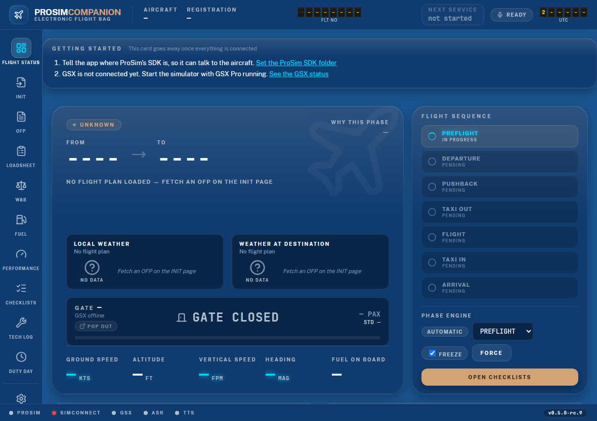
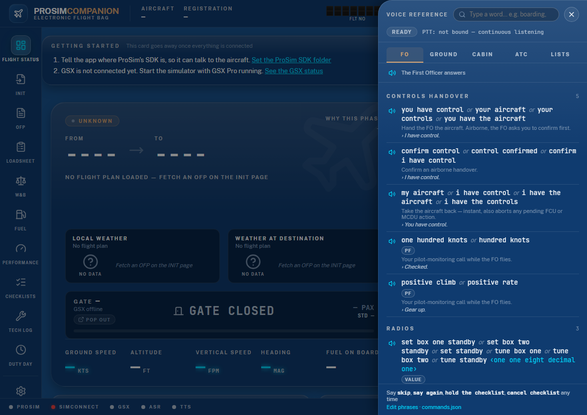
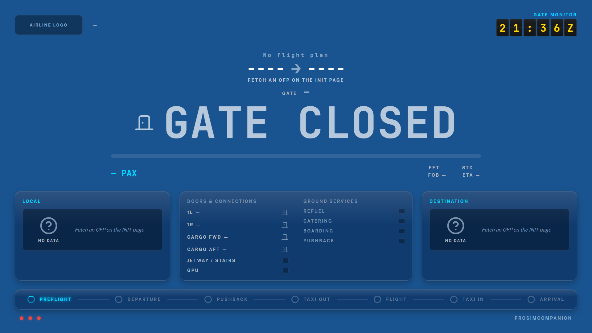
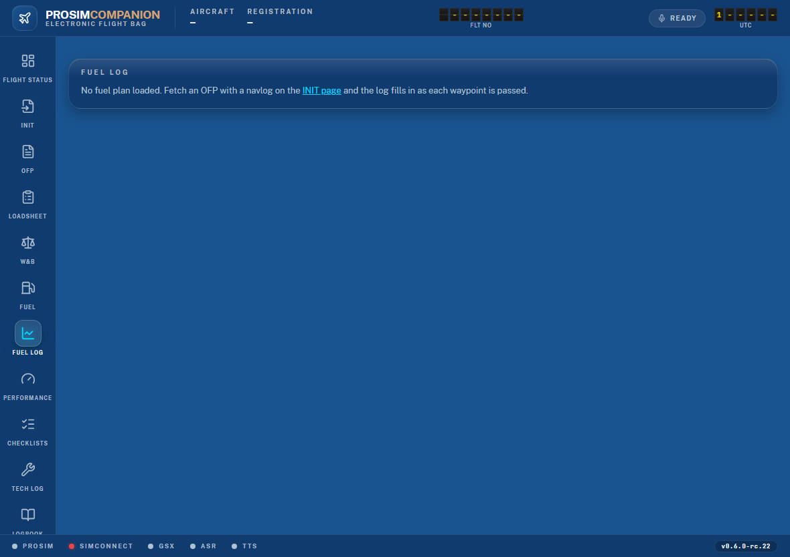
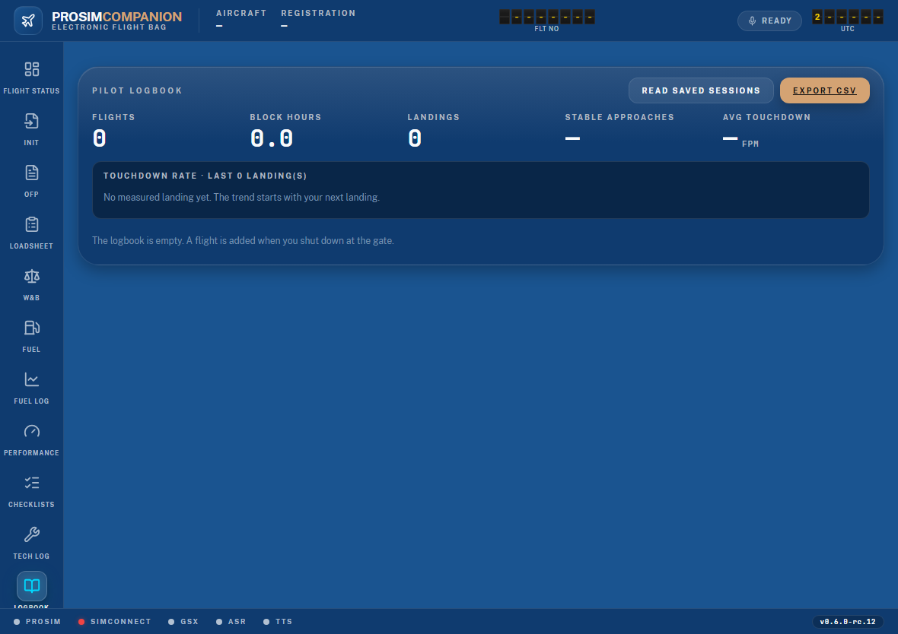
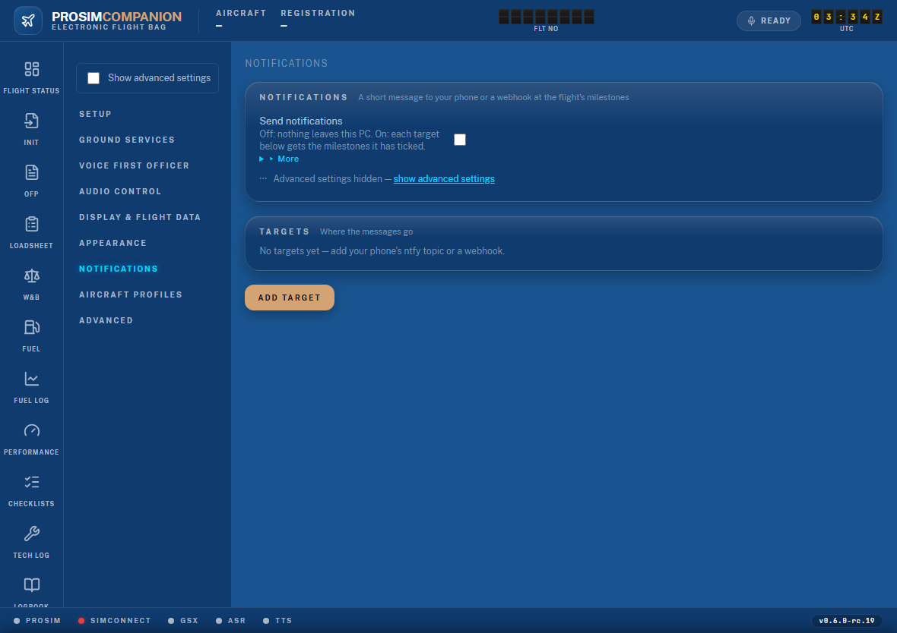

# Using the app

## Desktop shell & tray

The desktop window shows subsystem connection states and the web-server card (port, LAN
binding, access token, QR). Minimizing hides the window to the **system tray**; double-click
the tray icon (or *Show Window*) to bring it back, *Open Web UI* to jump to the browser,
*Exit* to quit. Closing the window exits the app. Starting the app twice just brings the
running instance's window to the front.

## Web UI tour

The web UI is laid out like an electronic flight bag. The **header** carries the aircraft type
and registration (from the OFP), the flight number and the SIM/UTC clock on split-flap
displays, a theme picker and the ProSim connection dot. Home cockpits that never touch the
INT/RAD switch can add a **NEXT SERVICE** button to the header (Settings → Appearance): it
names the next departure service, why it is holding, and calls it on a click — on every page.

The **mic pill** in the header (READY, LISTENING with a pulsing dot, or PAUSED) opens the
**Voice Reference** on any page: every phrase
the First Officer, the ground crew, the purser and SayIntentions ATC understand, on five tabs
(FO · Ground · Cabin · ATC · Lists). Each row shows the phrase and its alternatives, what
happens and what the crew says back; badges mark phrases that need the FO as pilot flying,
INT or CAB on the audio panel, a flight phase, a value, or that open a dialogue. The head shows
whether the FO is listening and which PTT key or button is bound; the search box filters every
tab. The list is built from what the recognizer actually listens for right now, so a
switched-off feature shows dimmed with the setting that turns it on.

The **sidebar** on the left lists the
flight pages in flight order with Settings pinned at the bottom; on a phone it becomes a
scrolling icon strip. The **footer** shows the ProSim, SimConnect and GSX connections and the
running version.

| Page | What it does |
|---|---|
| **Flight Status** | Route hero with two weather cards (local weather / weather at destination: sky graphic, wind, visibility, ceiling, temperature, QNH, ATIS letter, METAR time), the gate monitor strip (Gate Closed → Gate Open → Boarding → Final Call → Gate Closed, with the passenger count and the STD countdown) and its **Pop out** button, the live ground speed / altitude / vertical speed / heading / fuel figures, the distance row (to go, flown, ETA, top of descent — direct distances, see the Flight Monitor notes below), the flight sequence with the phase-engine controls, then the Sim/App/GSX/Services cards with state pills. Final-call thresholds, the weather refresh cadence and the top-of-descent notice live under Settings → Display & Flight Data → Flight Status card |
| **Flight Monitor** (pop-out) | A second-monitor board opened from the gate strip's Pop out button (or at `/monitor`) — see below |
| **INIT** | MCDU-style OFP display: fetch the SimBrief OFP, per-field overrides (ZFW, fuel, pax, cargo), SYNC TO FMS, confirm fuel (orders the fuel truck — unless the fuel on board already meets the figure, then it answers "Refueling is not needed" and no truck comes), flight reset |
| **OFP** | Flight-plan hero, arrival-gate assignment, weather (METAR/TAF/ATIS), pushback-direction Korry buttons, de-ice holdover card |
| **Loadsheet** | Prelim/final loadsheets with per-weight MAC envelope brackets, manual STD, resend/reset |
| **W&B** | Aircraft silhouette with doors and pax/cargo totals, weight summary bars, the CG envelope chart with valid MAC ranges, loading breakdown, passenger manifest, SIMULATE |
| **Fuel** | Fuel summary with capacity bar and delta, tank breakdown |
| **Fuel Log** | The paper OFP's fuel column: plan vs actual at your point on the navlog, estimated landing fuel, a burn chart, the waypoint table that fills in as you pass each fix, and the First Officer's spoken fuel checks — see below |
| **Performance** | Takeoff and Landing switch — airport/runway card with runway chips, runway diagram and wind components, weather, aircraft config, FMGC figures, FMS PERF uplink |
| **Checklists** | ECAM-style interactive checklists with a completion bar and the checklist sequence rail (visual runner; the voice FO runs beside it) |
| **Tech Log / Duty Day** | MEL & tech log, multi-leg company day mode with a legs timeline |
| **Logbook** | Your flights: totals (flights, block hours, landings, stable-approach rate, average touchdown rate), the touchdown-rate trend, a table you can sort by any column, the detail of one flight (times, runways, touchdown rate / speed / pitch, bounces, abnormals), delete (two clicks) and **Export CSV** — see below |
| **⚙ Settings** | Everything you configure, on one rail (below) |

### The Flight Monitor window

**Pop out** on the Flight Status gate strip opens the Flight Monitor in its own browser window
(drag it to a second monitor, or open `/monitor` on the iPad). It is one fixed 1920×1080
picture that scales as a whole to the window, so nothing ever overlaps whatever the size or
shape. It changes face with the flight:

| Mode | When | What it shows |
|---|---|---|
| **Gate monitor** | at the stand | your airline logo (Settings → Appearance → Airline logos, matched to the OFP's airline code), flight number, route with airport names, the gate, the big state word (GATE CLOSED / GATE OPEN / BOARDING / FINAL CALL / GATE CLOSED), the passenger bar, EET / fuel / STD countdown / ETA, doors, jetway and GPU, the ground-services lamps, the local and destination weather cards, the flight sequence strip |
| **Flight monitor** | pushback → landing | the phase as the big word (PUSHBACK AND START, CLIMB, CRUISE…), the cruise level, the route strip (below), elapsed time, distance to go, off-blocks time and ETA, minutes to top of descent, ground speed / altitude / vertical speed / heading, gear / flaps / seat-belt signs / beacon; the local weather card follows the aircraft (destination from descent, the alternate on the second card) |
| **Arrival monitor** | taxi-in → shutdown | TAXI IN / ON BLOCKS / DEBOARDING / ARRIVED, the arrival gate, the deboarding bar, block-in time, block and flight times, doors, GPU and the arrival services |

The header clock is sim time. The footer dots are the real ProSim / SimConnect / GSX connections.

**The route strip and the distance figures.** In flight the bar becomes a route strip: a
straight line from the origin (left dot) to the destination (right dot), with the aircraft
marker on it. The line is the great circle — the shortest way between the two airports — so a
marker that sits above or below it is that far off the direct line, on the same scale. The
marker points the way the aircraft is tracking; the gold **T/D EST** tick is the estimated
top of descent. Beside it:

- **TO GO … NM DIRECT** — the straight-line distance to the destination. It is *not* the
  distance along your route, so it reads short when the route has a dog-leg.
- **ETA … GS** — when you reach the destination at the present ground speed. **ETA … PLAN**
  means the planned time instead (takeoff plus the OFP enroute time) — the app shows that on
  the ground and whenever it has no position.
- **T/D … MIN EST** — minutes to the top of descent, estimated with the 3:1 rule (three miles
  for every thousand feet between your cruise level and the destination elevation). It is an
  estimate and it errs early; your FMS is the authority.

The caption under the strip says where the figures come from: *Great-circle direct · from
position*, or *Time-based* when the app has no aircraft position or could not locate the
airports. Airport positions come from ProSim's own airport data, or from your Navigraph
database (Settings → Setup) when ProSim has none. With neither, everything still works on the
time-based values. The same figures are on a small row under the telemetry on Flight Status.

The aircraft on the strip is a plain top-down outline that turns with your track. The clock
top-right is a split-flap display like the header's (amber on black in every theme; it flips
only if Solari animation is on in Settings → Display & Flight Data). Each weather tile shows
the METAR observation time, the ATIS letter and "updated n min ago", so you can see the cards
are live — the METAR is re-read every ten minutes and the ATIS letter is re-read with it.

### The Fuel Log page

**Fuel Log** in the sidebar is the fuel column of a paper OFP, kept for you. It needs an OFP
with a navlog (SimBrief); without one it says so.

- **Plan vs actual** — fuel on board now against the OFP's fuel at your exact point on the
  navlog (between the last fix and the next), the delta, and the **estimated landing fuel**
  (the planned landing fuel moved by that delta — the same rule the First Officer's fuel
  check uses). The pill says **holding**, **gaining** or **losing** from the last three
  fixes. **Fuel check now** makes the First Officer speak a fuel check (the same as saying
  *"fuel check"*); **Open OFP** jumps to the plan.
- **Burn** — the planned fuel line across the route, your actual fuel as dots, the planned
  landing fuel as a gold dashed line and, dashed in cyan, where you land at the present delta.
- **Fuel log** — one row per navlog fix: planned and actual time, minutes early or late,
  planned and actual fuel, and the difference. Rows fill in as each fix is passed; the ones
  ahead show the plan in grey. Nothing is stamped before takeoff: the first row is the
  takeoff fuel at the takeoff time. A new OFP starts a fresh log; the log is kept for the
  session (restart the app and the past rows are gone — each row is also in the session log).
- **FO fuel checks** — every fuel check the First Officer spoke this session, newest first,
  with the exact words.

### The Logbook page

**Logbook** in the sidebar shows every flight the app has recorded. A flight is added when
you shut down at the gate.

- **Totals** — flights, block hours, landings, how many approaches the gates judged stable,
  and your average touchdown rate.
- **Touchdown rate trend** — the small chart shows your last landings, oldest on the left.
  Higher is softer. The bright dot is your latest landing; the faint dashed line is the
  average. Hover a dot to read the flight and the figure.
- **The table** — click a column heading to sort by it; click again to turn the order round.
  Flights with no value in that column stay at the bottom.
- **The detail** — click a row. The panel on the right shows the off-blocks, takeoff, landing
  and on-blocks times (sim time, UTC), runways, lift-off speed, and the landing: touchdown
  rate, IAS, ground speed, pitch and bounces. Click the row again, or the ✕, to close it.
- **Delete flight** — in the detail panel. Press it once and it reads CONFIRM DELETE; press
  again within three seconds to delete. A deleted flight does not come back.
- **Export CSV** — downloads every flight as a spreadsheet file. Times are UTC
  (`2026-10-03T08:11:05Z`), numbers use a decimal point whatever your Windows region is, and
  an unknown value is an empty cell.
- **Read saved sessions** — adds any flight that is still in the app's session files but not
  in the logbook (for example flights flown while the logbook was switched off).

**What the touchdown rate is.** It is the vertical speed, in feet per minute, at which the
aircraft arrived: the lowest reading in the second before the wheels touched, not the reading
at the instant of contact (the flare has already arrested that one). Minus 100 to minus 250
is a normal airline landing. A **bounce** is counted when the wheels leave the ground and
touch again within five seconds. If you touch down and go around, that touch is not your
landing — the logbook records the landing that ended the flight. Flights flown before this
feature show a dash. The FO also reads the figure in the debrief ("touchdown at minus one
eighty feet per minute").

### The Settings hub

The Settings entry (bottom of the sidebar) opens a rail grouped by pillar. Every section has
its own address, so a refresh or a link from a warning banner lands on the right cards.

| Rail entry | What it holds |
|---|---|
| **Setup** | The three master switches (GSX ground services, voice First Officer, audio control), the ProSim host/SDK path, nav data, web port/LAN access, the Stream Deck command API |
| **Ground Services** | Status board (departure services with hold/skip reasons, decision log, gate control, the live GSX menu card) and all GSX behaviour: doors & jetway, ground equipment, departure services, refuel & boarding, pushback, arrival, operators & hubs, GSX questions, connection & timeouts |
| **Voice First Officer** | Status (provider tests, minima card, speak test), general, listening & PTT, sterile cockpit, crew voices, ground crew, cabin crew, briefings & LLM, MCDU, SayIntentions, voice providers |
| **Audio Control** | Status, backend choice, CoreAudio mappings, VoiceMeeter mappings, housekeeping |
| **Display & Flight Data** | Units, split-flap animation, loadsheet automation, the Flight Status card (final-call thresholds, weather refresh, top-of-descent notice), checklist ticks |
| **Appearance** | Theme swatches, the header NEXT SERVICE button toggle, your theme logos for the header, your airline logos for the Flight Monitor |
| **Aircraft Profiles** | Per-aircraft settings profiles with automatic matching |
| **Advanced** | Flight phase engine thresholds, the live log viewer with capture settings |

**Show advanced settings** (top of the rail) reveals the tuning fields — timeouts, intervals,
thresholds — that most users never touch. Greyed-out fields belong to a switch that is off.

## A typical flight

1. **Cold & dark at the gate.** Ground prep runs automatically: reposition → GPU + chocks
   (+PCA per settings) → jetway or stairs. Nothing else happens until a flight plan exists.
2. **Load the plan.** Enter the route in the MCDU (or press FETCH OFP on INIT). The SimBrief
   import writes the booked seat map, planned fuel and cargo into the ProSim EFB.
3. **Departure services** run in your configured order (default: cleaning/lavatory on
   turnarounds, refuel + catering in parallel, water, then boarding last). The INT/RAD
   switch, the header's NEXT SERVICE button (opt-in) or the GSX page's button force-calls
   the next service. Refuel steps the ProSim
   fuel while the GSX hose is connected; boarding fills seats as GSX counts pax aboard.
4. **Loadsheets.** The preliminary loadsheet arrives when refuel starts; the final one after
   boarding completes (dispatcher delay). Doors close and the jetway retracts on final —
   or, with the beacon sequence enabled, everything runs off the beacon: APU up → doors →
   jetway → ground equipment → pushback, with crew-realistic random delays.
5. **Pushback.** The cabin crew report "cabin secure" a random while after the doors are
   closed and the beacon is on — a minimum wait plus up to a second per passenger, so a full
   cabin can still be securing at the holding point (Settings → Voice First Officer → Cabin
   Crew). Until then a "cockpit to cabin" hail gets "still securing". GSX's questions
   (direction, tug, de-ice) are answered per your settings — and any menu GSX leaves for you
   (an addon airport's named pushback directions, for instance) shows as buttons in the
   **GSX menu** card on Flight Status, the OFP page and Ground Services: pick a line there
   instead of opening the GSX window. The card refuses picks while the automation is
   answering the same menu, and a line that moved before your click landed is not sent —
   every answer, and every "left for you", is in the decision log.
6. **Flight.** The arrival gate you confirmed on the OFP page is sent to GSX (and
   SayIntentions ATC) at cruise. The voice FO runs callouts, monitors flows, and briefs on
   request.
7. **Arrival.** Once stably parked (engines off, brake set, beacon off): fuel is remembered
   for next session, chocks go in after a crew-realistic delay, jetway/stairs connect,
   deboarding is called and the cabin empties front-first. At shutdown the FO debriefs, the
   logbook folds the flight and the tech log carries its sectors.

## Notifications on your phone

Away from the flight deck during a long turnaround? **Settings → Notifications** pushes a
short message at the milestones: refuel complete, boarding complete, final loadsheet sent,
ready for pushback, cabin secure, deice holdover expiring, top of descent approaching,
landed, on blocks, deboarding complete. Each fires once per flight.

Turn on **Send notifications**, then **Add target**. A target is one place to notify:

- **ntfy** — the easiest phone route. Install the ntfy app, subscribe to a topic with an
  unguessable name, paste `https://ntfy.sh/<your topic>` as the URL. Treat the topic name as a
  password — anyone with it can read your messages.
- **Discord** — a channel's webhook URL (channel settings → Integrations → Webhooks).
- **Webhook** — any https address that takes a JSON POST (Home Assistant, Node-RED, your own
  script). The body is documented in `docs/integrations/notifications.md`.

Tick the events the target should get, add a **Bearer token** if the service needs one, save,
then **Send test** — the result line says `Sent · 200 OK` or why not. URLs and tokens are
stored encrypted on the sim PC and never written to the log; the log and the diagnostics bundle
name the target and the HTTP status only.

A slow or dead target never slows the ground automation or the First Officer: messages go
out in the background with a five-second limit, and a target that fails is left alone for a
minute (its status pill reads `FAILED` until the next good send).

## Themes & units

Thirteen built-in themes — KLM Royal Dutch (the default), Lufthansa, Swiss International,
British Airways, Air France, Singapore Airlines, Emirates, Qatar Airways, United Airlines,
Qantas, Finnair, Light and Dark — switch live from the header picker or from Display & Flight
Data; both write the same setting. Drop your own JSON themes in `config/themes` (Prosim2GSX
theme format). Weight displays follow the app unit setting or the aircraft's own unit
selection (kg/lb); settings entry fields stay in kg.

Logos are yours, never shipped: Settings → Appearance takes a **theme logo** (shown in the
header while that theme is active) and **airline logos keyed by ICAO airline code** (KLM, BAW,
DLH…), which the Flight Monitor shows for the flight plan's airline. Both live under
`%LOCALAPPDATA%\ProsimCompanion\config\themes\logos`.
