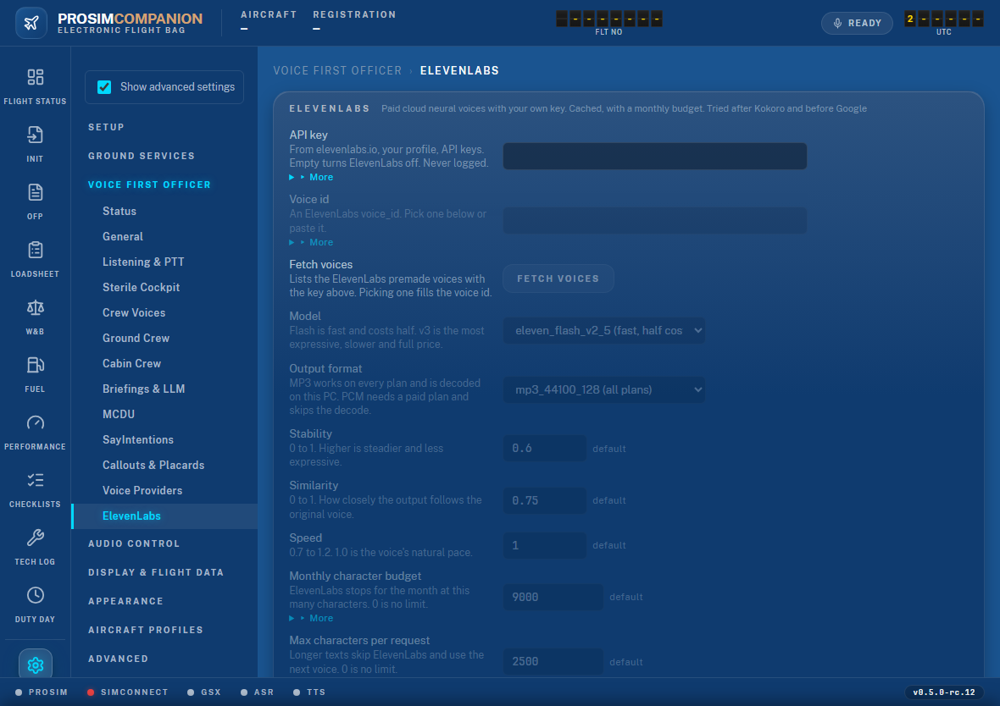

# ElevenLabs voices — setup guide

ElevenLabs is a paid cloud service with very natural voices. ProsimCompanion can use it for
the First Officer, the purser, the company voice and the ground crew. You bring your own
ElevenLabs account and API key; the app never ships one.

Available from **0.5.0-rc.12**.

## Before you start

**How the app picks a voice.** Voices are tried in a fixed order:

1. Kokoro (your own local server)
2. **ElevenLabs**
3. Google
4. Windows voices

The first one that is set up and working speaks. Two things follow from that:

- If you have a **Kokoro** server configured, Kokoro speaks and ElevenLabs is only the
  backup. To make ElevenLabs the main voice, clear the Kokoro *Base URL* (Settings → Voice
  First Officer → Voice Providers).
- **Local only** (Settings → Voice First Officer → General) switches every network voice
  off, ElevenLabs included. Leave it unticked.

**Which ElevenLabs plan.** Figures from elevenlabs.io/pricing in October 2026 — check the
page, they change:

| Plan | Price per month | Credits per month | Commercial licence |
|---|---|---|---|
| Free | $0 | 10,000 | No |
| Starter | $6 | 30,000 | Yes |
| Creator | $22 | 121,000 | Yes |
| Pro | $99 | 600,000 | Yes |

One credit is about one character of speech. The default model (Flash) costs about half a
credit per character. The Free plan is enough to try it out. For regular flying, Starter or
Creator is the realistic choice.

## Set it up

1. **Get your API key.** Sign in at <https://elevenlabs.io>, open your profile, then
   **API keys**, and create a key. Copy it.
2. In ProsimCompanion open **Settings → Voice First Officer → ElevenLabs**
   (`http://localhost:5320/settings/speech/elevenlabs`).
3. Paste the key into **API key**. The other fields unlock.
4. Press **Fetch voices**. A list of the ElevenLabs premade voices appears, each with its
   accent and gender. Pick one. The **Voice id** field fills in by itself.
   You can also paste a voice id by hand — for example a voice from your own ElevenLabs
   voice library.
5. Leave **Model** on `eleven_flash_v2_5` and **Output format** on `mp3_44100_128`. These
   work on every plan.
6. Set **Monthly character budget** for your plan (see "Keeping the cost down" below).
7. Press **Save** in the bar at the bottom of the page.

ElevenLabs is active as soon as the key and a voice id are both saved. No restart is needed.

## Check that it works

1. Open **Settings → Voice First Officer → Status**.
2. In the **TTS Providers** table find the `elevenlabs` row and press **Test**. The test
   speaks with ElevenLabs only — there is no fallback, so if you hear the voice, it works.
3. Use **Speak Test** lower on the page to hear the whole chain as the FO uses it in
   flight. If Kokoro is still configured, this is where you will hear Kokoro instead.

The footer of every page has a **TTS** dot. Green means a voice provider is ready.

## The settings, one by one

| Setting | What it does | Suggested value |
|---|---|---|
| API key | Your ElevenLabs key. Empty switches ElevenLabs off. | — |
| Voice id | The First Officer's voice. | Pick with Fetch voices |
| Model | `eleven_flash_v2_5` is fast and costs half. `eleven_v3` is more expressive, slower and full price. | Flash |
| Output format | `mp3_44100_128` works on every plan. `pcm_24000` needs a paid plan that allows PCM output; it saves a small decode step. | MP3 |
| Stability | 0 to 1. Higher is steadier and less expressive. | 0.6 |
| Similarity | 0 to 1. How closely the output follows the original voice. | 0.75 |
| Speed | 0.7 to 1.2. 1.0 is the voice's natural pace. | 1.0 |
| Monthly character budget | ElevenLabs stops for the rest of the month at this many characters; the next voice in the chain takes over. 0 means no limit. | See below |
| Max characters per request | A longer text (a long briefing) skips ElevenLabs and uses the next voice. 0 means no limit. | 2,500 on the Free plan |
| Text normalisation | Lets ElevenLabs expand numbers itself. Leave it **off**: the app already writes "flight level three five zero" the spoken way, and the ElevenLabs normaliser gets aviation words wrong. | Off |
| Base URL, Timeout | Advanced. Only for a proxy, or a slow connection. | Leave as they are |

## Crew voices

The purser, the company voice and the ground crew each have their own voice field
(**Settings → Voice First Officer → Crew Voices**). While ElevenLabs is the voice that
speaks, these fields must hold **ElevenLabs voice ids**. A Kokoro name such as `af_heart` or
a Google name will not work there.

To give each crew member a different voice:

1. On the ElevenLabs page press **Fetch voices** and pick the voice you want for the purser.
2. Copy the id that appears in **Voice id**.
3. Paste it into **Purser voice** on the Crew Voices page.
4. Repeat for the company and the ground crew.
5. Go back and pick the First Officer's voice again, then **Save**.

A blank crew field uses the First Officer's voice. The ground crew's *Accent Localization*
needs Google; with ElevenLabs the ground crew keeps the voice you set here.

## Keeping the cost down

- **Everything is cached.** Each phrase is fetched once and then played from disk, for
  free, forever. Checklists and standard callouts are the same words every flight, so after
  the first flight or two most speech costs nothing.
- **The app warms the cache.** When the app starts, and when you edit a checklist, it
  fetches the checklist and callout phrases in the background so that "V one" never waits
  for the network. This spends characters once, the first time. On the Free plan it can
  take a large share of the month's 10,000, and it stops at your budget.
- **Changing the voice, the model or the format starts a new cache.** The old audio is
  kept, but new phrases are fetched again. Pick your voice before you fly a lot.
- **Set the budget.** The budget counts characters sent to ElevenLabs (cache hits are not
  counted). A safe figure is a little under what your plan gives: the default 9,000 suits
  the Free plan; about 28,000 for Starter; about 110,000 for Creator. With the Flash model
  each character costs about half a credit, so these figures leave a wide margin.
- **Usage this month** is shown at the bottom of the ElevenLabs page. The counter is the
  file `usage.elevenlabs.json` in the speech cache folder.

When the budget is reached the FO does not go silent. The next voice in the chain (Google
or a Windows voice) takes over until the next month.

## If something is wrong

| What you see | Why | What to do |
|---|---|---|
| "Fetch failed: … 401" | The key is wrong or was deleted at ElevenLabs. | Paste the key again and Save. |
| The `elevenlabs` row on the Status page shows a failure after a 401 | Same. The app stops calling ElevenLabs until the settings change. | Paste a good key and Save. |
| The Test works but the FO still sounds like before | Kokoro is configured and comes first, or the phrase came from an older cache. | Clear the Kokoro Base URL. |
| No ElevenLabs voice at all | *Local only* is ticked, or the voice id is empty. | Untick Local only; pick a voice; Save. |
| The purser or ground crew has the wrong voice or a Windows voice | The crew voice field holds a Kokoro or Google name. | Put an ElevenLabs voice id there, or leave it blank. |
| ElevenLabs stopped mid-month | The monthly budget was reached. | Raise the budget, or wait for the new month. |
| Long briefings use another voice | The text is longer than *Max characters per request*. | Raise the figure if your plan allows longer generations. |
| An error after you chose `pcm_24000` | Your plan does not include PCM output. | Go back to `mp3_44100_128`. |
| "API key … re-enter it and save" under the field | `settings.json` was copied from another PC or Windows account. | Paste the key again and Save. |

For anything else: reproduce it, then use **Export diagnostics** on the Logs page and send
the zip. Your key is never in the logs and is removed from the exported settings.

## Privacy

- The key is stored encrypted for your Windows account (`dpapi:…` in `settings.json`). It
  only works on this PC and this account.
- Only the text the app is about to speak is sent to ElevenLabs. No flight data, no
  microphone audio.
- *Local only* guarantees nothing is sent at all.
