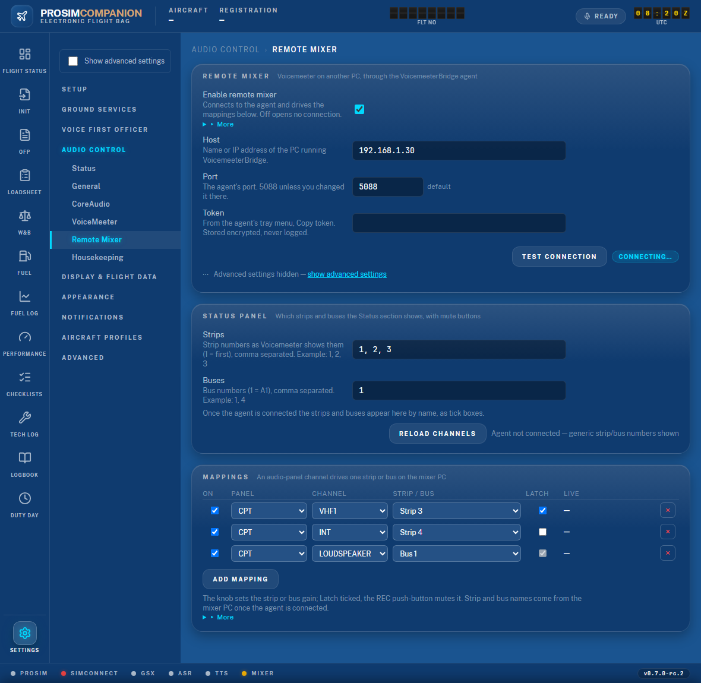
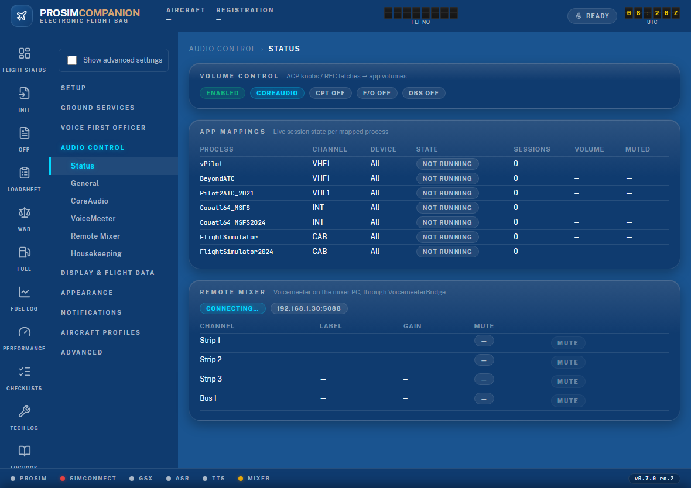

# 9. The remote mixer: a Voicemeeter on another PC

Many cockpits run vPilot (or another ATC client) on a second PC with its own Voicemeeter.
The app can drive **that** Voicemeeter from the cockpit: an audio panel knob sets a strip
or bus gain, a REC push-button mutes it, and a status card shows what the mixer is doing
with a Mute button per channel. This works through **VoicemeeterBridge**, a small agent
that runs in the tray of the mixer PC and talks to its Voicemeeter for us.

This is separate from the VoiceMeeter backend of Audio Control (Settings → Audio Control →
Volume Control), which drives the Voicemeeter on the **sim PC** through its DLL. You can use
both at the same time.

## 9.1 What you need

- Voicemeeter (Standard, Banana or Potato) running on the mixer PC.
- **VoicemeeterBridge** installed and running on that same PC. Download
  `VoicemeeterBridge-Setup-<version>.exe` from
  <https://github.com/psyraxaus/VoicemeeterBridge/releases> and follow its own install
  guide (the README in that repository). It shows a tray icon.
- Both PCs on the same network. The sim PC must reach the mixer PC on the agent's port
  (**5088** unless you changed it in the agent).

## 9.2 Set up the mixer PC (once)

1. Start Voicemeeter, then VoicemeeterBridge.
2. Right-click the tray icon → **Copy token**. Paste it somewhere safe for the next step.
   It is the shared secret; without it the app cannot talk to the agent.
3. Allow the agent's port through Windows Firewall on the mixer PC (inbound TCP 5088, private
   network, or only from the sim PC's address).
4. Check from the sim PC: open `http://<mixer-pc>:5088/health` in a browser. You should see
   `{"voicemeeter":{"connected":true},"clients":0}`. If the browser cannot connect, fix the
   firewall or the address before you go on. If it says `"connected":false`, Voicemeeter is
   not running on the mixer PC.

## 9.3 Connect the app

Settings → **Audio Control → Remote Mixer**:

1. **Host**: the mixer PC's name or IP address. **Port**: 5088. **Token**: paste it.
2. Click **Test connection**. A green pill reads *Connected. Voicemeeter potato 3.1.1.2 is
   running.* (your edition and version). A red pill names the problem: *unauthorized* is a
   wrong token, *No answer* is the address, port or firewall.
3. Tick **Enable remote mixer** and **Save**.

The pill beside the Test button then shows the live state of the saved link. A `Mixer` dot
joins the footer while the feature is on. The link reconnects by itself when the mixer PC
is off or restarts; the first failure is logged, later retries are quiet.

The token is stored encrypted in `settings.json` and never written to the log.

## 9.4 Pick the strips and buses for the status card

Still on the Remote Mixer section, **Status Panel**. Once the agent is connected the app
has read the strip and bus names from the mixer PC, and they appear as tick boxes:
*Strip 3 — vPilot*, *Bus A1 — Headset*, and so on. Tick the ones you want on the card.
**Reload channels** reads the names again after you rename a strip in Voicemeeter.

Before the first connect the section shows two text boxes instead: strip numbers as
Voicemeeter counts them from the left (`1, 2, 3`), and bus numbers (`1` is A1).

Save. Settings → Audio Control → **Status** now has a **Remote Mixer** card with each
channel's Voicemeeter label, gain and mute state, live, and a **Mute** / **Unmute** button.
The card follows changes made anywhere: a knob, the Voicemeeter window on the mixer PC, a
macro button.

(The picture was taken with the agent unreachable — *Connecting…* and dashes. With the link
up the pill is green and the rows show the real labels, gains and mute states.)

## 9.5 Map a channel

Settings → Audio Control → Remote Mixer → **Mappings**. The editor works like the local
VoiceMeeter one: one row per audio-panel channel.

1. Click **Add mapping**. The row comes filled in: *Captain*, the first channel not yet
   mapped (VHF1 to start), the first strip, **Latch** ticked.
2. **Panel**: Captain, First Officer or Observer. **Channel**: VHF1 … PA, or LOUDSPEAKER
   on the captain's and first officer's panels.
3. **Strip / bus**: pick the target by its Voicemeeter name — *Strip 3 — vPilot*,
   *Bus A1 — Headset*. The names come from the mixer PC; before the first connect the
   list shows plain numbers.
4. **Latch**: ticked, the channel's REC push-button mutes and unmutes the target. Unticked,
   the mute is never written, so a strip you muted on the mixer PC stays muted. The
   LOUDSPEAKER dial has no push-button: fully down always mutes its target.

Save. Turn the knob: the **Live** column shows the gain last sent and the mute state, for
example `-17.0 dB · open`, and, if the agent refused the write, why (`unknown parameter`
means the strip or bus does not exist in that Voicemeeter edition).

### Fine-tuning

- The knob's travel maps to −60 … +12 dB, like the local backend: fully up is louder than
  unity, 0 dB sits at about 83 % of the knob. Both ends are under the connection card's
  advanced fields (**Show advanced settings** in the rail): set the top to 0 dB for a
  strip that must never go past unity.
- **On**: untick a row to keep it without using it.
- The knob value goes out whether the audio panel is powered or not.
- Writes are limited to 20 per second per parameter; a knob at rest sends nothing. After a
  reconnect every current value is sent once, so the mixer catches up on its own.
- Two rows on one strip: the last knob to move wins.

## 9.6 If it does not work

| Symptom | Check |
|---|---|
| Test says *No answer* | Address and port; firewall on the mixer PC; the agent is running (tray icon). Try the `/health` page from 9.2. |
| Test says *unauthorized* | Copy the token again from the agent's tray menu and paste it fresh. |
| Pill says *Connected — Voicemeeter not running on the mixer PC* | Start Voicemeeter there. The agent reconnects to it by itself and the pill turns green. |
| Status card shows `—` for a channel | That strip or bus number does not exist in this Voicemeeter edition (Standard has 3 strips, Banana 5, Potato 8). The log says `parameter Strip[7].Gain cannot be read`. |
| Knob moves, nothing happens | Is the row **On**? Does the **Live** column show a value? `not_connected` means the link is down; `unknown parameter` means that strip or bus does not exist in this Voicemeeter edition; a dash means no knob value has arrived from ProSim yet. |
| The REC button does not mute | Is **Latch** ticked on that row? The LOUDSPEAKER dial has no button: it mutes fully down. |
| The level jumps between two values | Two rows send to the same parameter. Keep one. |

The log (Settings → Logs) prefixes every line with `Mixer`. The wire trace channel is
`Mixer` if support asks for frames.
